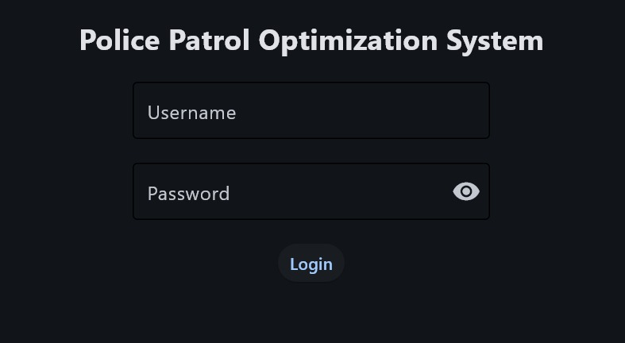
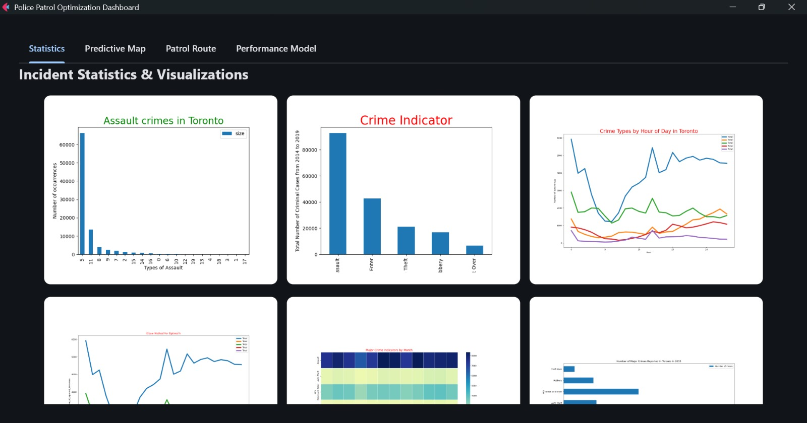
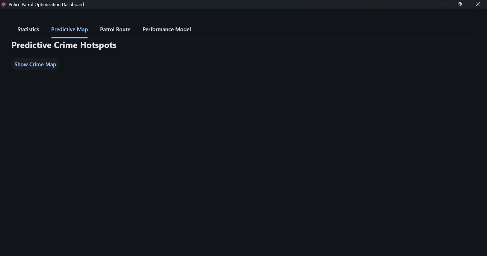
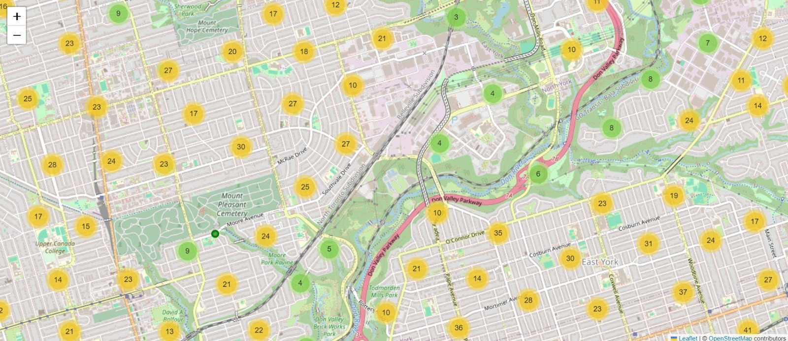
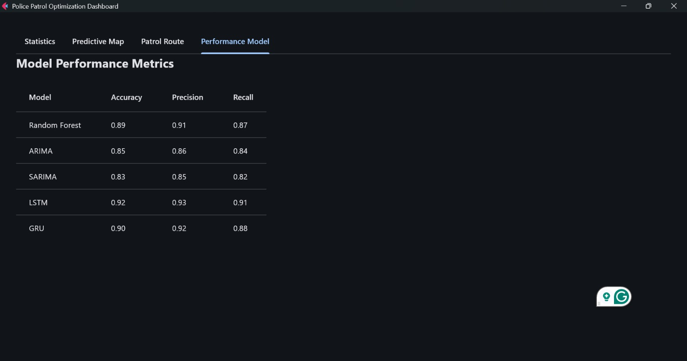

# Crime-Mapping-Predictive-Analysis-Policing-System
Crime Mapping and Predictive Analysis System for Enhanced Policing

This project is a Crime Mapping and Predictive Policing System designed to help law enforcement agencies optimize patrol routes, predict crime hotspots, and visualize crime statistics, presented at Hack JKLU v4.0. The system uses historical crime data, geospatial analysis, and machine learning to provide actionable insights for efficient policing.
<br>

**Key Features:**
- Crime Hotspot Prediction: Visualize crime hotspots on a map using historical data.
- Optimized Patrol Routes: Generate optimized patrol routes using the A* algorithm.
- Crime Statistics: View crime statistics and visualizations.
- Performance Model: Analyze the performance of policing strategies.
- User Authentication: Secure login system with rate limiting.

**Technologies Used:**
- Python: Core programming language.
- Flet: For building the user interface.
- Folium: For creating interactive maps.
- Pandas: For data manipulation and analysis.
- Geopy: For geospatial calculations.
- Google Maps API: For fetching road data.
- A Algorithm*: For route optimization.

**Installation:**
Prerequisites: <br>
- Python 3.8+: Ensure Python is installed on your system.
- Google Maps API Key: Obtain an API key from the Google Cloud Console.

<br>

Steps: <br>
- Clone the repository: 
```bash
git clone https://github.com/IshitaAgarwal05/Crime-Mapping-Predictive-Analysis-Policing-System
cd Crime-Mapping-Predictive-Analysis-Policing-System
```

- Set Up a Virtual Environment:
```bash
python3 -m venv venv
source venv/bin/activate  # On Windows: venv\Scripts\activate
```

- Install Dependencies:
```bash
pip install -r requirements.txt
```

- Set Up Environment Variables, Create a .env file in the root directory and add your Google Maps API key:
```bash
API_KEY=your_google_maps_api_key
```

**Usage:**
- Running the application:
```bash
python3 app.py
```

**Features:**
- Login: <br>
a. Enter your username and password to access the dashboard.

- Dashboard: <br>
a. Statistics Tab: View crime statistics and visualizations. <br>
b. Predictive Map Tab: Visualize crime hotspots on a map. <br>
c. Patrol Route Tab: Generate optimized patrol routes. <br>
d. Performance Model Tab: Analyze policing performance.

- Generate Patrol Routes: <br>
a. Enter the police station's latitude and longitude.<br>
b. Specify the patrol start and end time.<br>
c. Click "Calculate Route" to generate the optimized patrol route.

- View Crime Map: <br>
a. Click "Show Crime Map" to view crime hotspots.

[**Demo Link**](https://youtu.be/e9ExeNsG3Kc)







